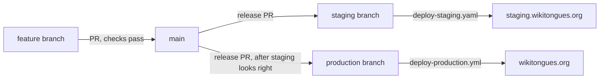

# Deployment and CI

How code gets from a branch to wikitongues.org, what runs on every pull request, and what a deploy does and doesn't do. For database backups and the production → staging data sync, see [staging-sync.md](staging-sync.md).

Server addresses, account names and credentials live in GitHub secrets and the team's private ops notes, never in this repo.

## Table of Contents

- [Environments](#environments)
- [Release flow](#release-flow)
- [Checks on every pull request](#checks-on-every-pull-request)
- [What a deploy does](#what-a-deploy-does)
- [What gets deployed](#what-gets-deployed)
- [How deleted files are removed](#how-deleted-files-are-removed)
- [Server trust](#server-trust)
- [Secrets](#secrets)
- [After a deploy](#after-a-deploy)
- [Backups and data sync](#backups-and-data-sync)
- [Troubleshooting](#troubleshooting)
- [Known gaps](#known-gaps)
- [History](#history)

---

## Environments

| | Local | Staging | Production |
|---|---|---|---|
| URL | `http://localhost:8888/wikitongues` | https://staging.wikitongues.org | https://wikitongues.org |
| Runs on | MAMP (PHP 8.5, MySQL) | GreenGeeks shared hosting (PHP 8.2, MariaDB) | Same server; staging is a separate WordPress install inside production's web root |
| Code arrives by | Your working tree | Merging a release PR into the `staging` branch | Merging a release PR into the `production` branch |
| Data arrives by | `bash tool-sync-db-from-prod.sh` (DB and uploads from production) | The weekly Sync to Staging workflow | — |

CI runs PHP 8.2, the same as the servers. `composer.json` pins `config.platform.php` to `8.2` so local installs resolve the same dependencies.

---

## Release flow

1. **Branch** from `main` as `type/cc/description` (`feature/cc/…`, `fix/cc/…`, `docs/cc/…`) and open a PR to `main`. Nothing is committed to `main` directly.
2. **Merge** once the [checks](#checks-on-every-pull-request) pass.
3. **Release to staging.** Open a PR from `main` into `staging`, titled `release: deploy main to staging — {date}`. Claude Code's `/deploy staging` command opens it. Merging it runs **Deploy to Staging**.
4. **Check staging**, then **release to production** the same way (`/deploy production`). Merging runs **Deploy to Production**.

The `staging` and `production` branches only ever take `main`, never a feature branch, and both are protected, so every deploy is a PR. For emergencies, each deploy workflow can also be run by hand (`gh workflow run deploy-production.yml --ref main`). That deploys immediately but leaves the release branch behind `main`.

---

## Checks on every pull request

| Workflow | Job | Runs | Blocks the PR? |
|---|---|---|---|
| Lint (`lint.yml`) | PHPCS | `composer lint`: WordPress-Core standard, including security sniffs | Yes |
| | ESLint | `npm run lint:js` | Yes |
| | PHPStan | `composer analyse`: level 5, with a baseline of known errors | Yes |
| Test (`test.yml`) | PHPUnit | `composer test`: unit tests with WP_Mock | Yes |
| Security (`security.yml`) | TruffleHog | Scans the PR's commits for verified secrets (action pinned to a commit SHA) | Yes |

GitHub's secret scanning and push protection are also on. Run all three local gates before opening a PR (`/test` in Claude Code runs lint, analyse and test in order). What each test layer covers is in [testing-strategy.md](testing-strategy.md).

---

## What a deploy does

Both deploy workflows run the same steps; only the branch, target folder and health-check URL differ.

1. Check out the release branch and install Node 20 dependencies (`npm ci`).
2. **Compile the CSS** (`npm run stylus:build`). The compiled `stylus/main.css` isn't committed; the deploy builds it.
3. **Pin the server's host key** from the `SSH_HOST_KEY` secret (see [Server trust](#server-trust)).
4. **Copy files** with `rsync`, honouring `.rsync-filter` (see [What gets deployed](#what-gets-deployed)). This pass adds and updates, but never deletes.
5. **Remove files deleted from the repo**, inside the theme and the four custom plugins only (see [How deleted files are removed](#how-deleted-files-are-removed)).
6. **Health check.** Fail the job unless the homepage returns 200.
7. **Tell Slack**: 🚀 on success, or ❌ with a link to the run log.

A deploy doesn't touch the database, uploads, `wp-config.php`, WordPress core, or third-party plugins. Those are managed on the server.

---

## What gets deployed

The deploy copies the repository minus the exclusions in `.rsync-filter`:

| Excluded | Why |
|---|---|
| `.git`, `.github/`, `.gitignore`, `.rsync-filter` | Repository machinery |
| `readme.md`, `plan.md`, `docs/`, `CLAUDE.md`, `.claude/`, `.vscode/` | Documentation and tooling have no place in the web root (#640) |
| `tests/`, `phpunit.xml.dist`, `phpcs.xml`, `phpstan.neon`, `phpstan-baseline.neon`, `eslint.config.js`, `.editorconfig`, `.npmrc` | Development configuration |
| `composer.json`, `composer.lock`, `package.json`, `package-lock.json`, `vendor/`, `node_modules/` | Build dependencies |
| `temp/` | Local scratch space |
| `stylus/require`, `stylus/main.styl` | Stylus sources; only the compiled `main.css` ships |

Anything not tracked in git never ships, because the deploy works from a clean checkout. Third-party plugins (ACF Pro, Classic Editor and others), uploads and `wp-config.php` exist only on the servers.

---

## How deleted files are removed

The main `rsync` never deletes. Before 2026-09-12, a file removed from the repo stayed on the servers, and some of it kept running: the theme loads every file in its `includes/` subfolders, ACF loads every file in `acf-json/`, and WordPress picks up any template it finds. Retired post types stayed registered after the PRs that removed them.

The delete pass (#634) runs `rsync --delete` over each of our own code folders:

- `wp-content/themes/blankslate-child`
- `wp-content/plugins/download-gateway`, `wt-airtable-sync`, `wt-gallery` and `typeahead`

Its safeguards:

- **It never copies.** `--existing --ignore-existing` means the pass can only delete.
- **It stops on a partial checkout.** If the theme's `style.css` or any plugin's main file is missing, it deletes nothing, since a partial checkout would look like a mass deletion.
- **It caps deletions** at 100 files per folder (`--max-delete=100`); past that, the step fails instead.
- **It keeps what it should.** The `error_log` file PHP writes is protected, and so is anything `.rsync-filter` excludes.

It works only inside those five folders because the web root also holds `wp-config.php`, uploads and, on production, the whole staging site. A repo-wide `--delete` would destroy them.

**What this means for you:**

- **Removing a file from the repo removes it from the servers** at the next deploy. That includes page templates: a page still assigned to a deleted template silently falls back to the default layout. Check before deleting one. This nearly broke the Donate page, whose template had been replaced in the repo months earlier but never switched in the admin.
- **ACF JSON is deleted too.** A field group created in wp-admin on a server and never committed loses its JSON file but keeps working from its database copy.
- **Files outside these folders are never cleaned up.** Something removed from the repo root stays on the server until someone deletes it by hand.

---

## Server trust

Every workflow that connects to the server (both deploys, Backup Prod DB, Sync to Staging) writes `known_hosts` from the `SSH_HOST_KEY` secret rather than running `ssh-keyscan`, which trusted whatever key answered and failed intermittently (#635). The step fails with a clear error if the secret is empty or unusable.

If the server's host key changes, for example after a server move, every workflow fails at "Add server to known hosts". Confirm the new key with the host through a channel other than SSH itself, then update the secret. Accepting whatever key answers defeats the check.

---

## Secrets

GitHub → Settings → Secrets and variables → Actions. Only the names are listed here.

| Secret | Used by | Holds |
|---|---|---|
| `SSH_PRIVATE_KEY` | All server workflows | The deploy key |
| `SSH_HOST`, `SSH_USERNAME` | All server workflows | Where to connect, and as whom |
| `SSH_HOST_KEY` | All server workflows | The server's pinned public host key |
| `PROD_DB_NAME`, `PROD_DB_USER`, `PROD_DB_PASS` | Backup Prod DB | Production database credentials |
| `STAGING_DB_NAME`, `STAGING_DB_USER`, `STAGING_DB_PASS` | Sync to Staging | Staging database credentials |
| `SLACK_WEBHOOK_URL` | Deploys, backup, sync | The Slack notification webhook |

Rotating a server-side credential, such as a database password, means updating the server (`wp-config.php`) and the matching secret together.

---

## After a deploy

The deploy only moves files. Some changes need a manual step on **each** environment:

| If the change… | Then… |
|---|---|
| Adds or changes a post type, archive or URL slug | Flush rewrite rules: open Settings → Permalinks (loading the page is enough) or run `wp rewrite flush --allow-root`. Until then, new URLs 404. |
| Edits ACF JSON | Optional: ACF → Field Groups shows "Sync available"; syncing reconciles the database copy. The front end already uses the JSON. |
| Ships a data migration (`wp wt …`) | Run it on staging, then production: dry run first, then `--execute`. Take a dated backup before production (see [staging-sync.md](staging-sync.md)). |
| Adds a setting stored in the database (gateway policies, options pages, menus) | Set it in the admin on each environment. |
| Changes the modal script or a plugin asset | Bump the plugin version constant, which sets the asset's `?ver=`, so browsers fetch the new file. |
| Changes CSS | Hard-refresh to check. The theme's `style.css` `@import`s `main.css` without a version string, so browsers can keep the old file. |

---

## Backups and data sync

[staging-sync.md](staging-sync.md) is the full runbook. The short version:

- **Backup Prod DB** (`backup-prod-db.yml`) dumps production every Monday at 03:00 UTC, or on demand, to `~/backups/prod_dump.sql`, outside the web root. It then triggers **Sync to Staging** (`sync-prod-to-staging.yml`), which imports that dump into staging, copies uploads and rewrites URLs.
- The dump is overwritten each run and keeps no history. Before a risky production write, keep a dated copy in `~/backups/` first.
- **GitHub silently disables scheduled workflows after 60 days without repository activity.** This happened once: the backup last ran 2026-06-22 and was found disabled on 2026-09-11. Check `gh workflow list --all` before relying on a sync.
- Never write a dump, export or log anywhere under `public_html`, where the web server can serve it.

---

## Troubleshooting

| Symptom | Likely cause | Fix |
|---|---|---|
| Fails at "Add server to known hosts" | `SSH_HOST_KEY` is empty, or the server's key changed | Confirm the key with the host, then update the secret |
| Fails at the delete pass: "missing from the checkout" | A core file isn't in the checkout | Check the branch; nothing was deleted |
| Fails at the delete pass after deleting 100 files | More than 100 deletions in one folder | Check the log's file list. If the deletions are intended, delete in batches or raise the cap in a PR. |
| Health check fails (homepage not 200) | A fatal PHP error, often a missing file or a syntax error in a template | Check the server's PHP error log; fix forward or redeploy the previous commit |
| New page or post type 404s | Rewrite rules not flushed | Settings → Permalinks on that environment |
| CSS change not visible | Browser cached the old `main.css` | Hard-refresh; check that the Stylus compile step passed |
| Page layout suddenly default | Its template file was deleted from the repo | Reassign a template in the admin, or restore the file |

---

## Known gaps

- **Only our five folders are cleaned.** Files removed from anywhere else in the repo (the root, other plugins) stay on the servers.
- **The health check covers the homepage only.** A fatal error confined to one template passes it.
- **Post-deploy steps are manual:** rewrite flushes, migrations and per-environment settings.
- **Scheduled workflows can be switched off silently** (the 60-day rule above).
- **WP-Cron depends on traffic.** No server cron is confirmed, and the download gateway's two scheduled jobs rely on WP-Cron ([download-gateway.md](download-gateway.md#scheduled-jobs)).
- **Third-party plugins and WordPress core are updated by hand** on each server and aren't tracked in git. Monitoring them for vulnerabilities is a planned item ([plan.md](../plan.md), Engineering foundations).

---

## History

| When | Change | PRs |
|---|---|---|
| 2026-02-19 | First CI and deployment pipeline: GitHub Actions, rsync deploys, `.rsync-filter` | #423, #425 |
| 2026-02-19 | PHPCS, ESLint and PHPStan in CI; PHPUnit in CI | #428, #432, #435 |
| 2026-02-21 | TruffleHog on PRs; GitHub push protection | — |
| 2026-03-05 | `npm ci`, homepage health check and Slack notifications in both deploys; post-import checks in the staging sync; the sync runbook | #503, #509, #511, #518 |
| 2026-09-08 | Claude Code project config committed (`CLAUDE.md`, `/deploy`, `/test`) | #605 |
| 2026-09-12 | Backups moved outside the web root | #633 |
| 2026-09-12 | Deploys remove files deleted from the repo (scoped delete pass) | #634 |
| 2026-09-12 | Server host key pinned in all workflows | #635 |
| 2026-09-12 | Debug logging that filled the PHP error logs removed | #639 |
| 2026-09-12 | Repo tooling no longer deployed to the web root | #640 |
