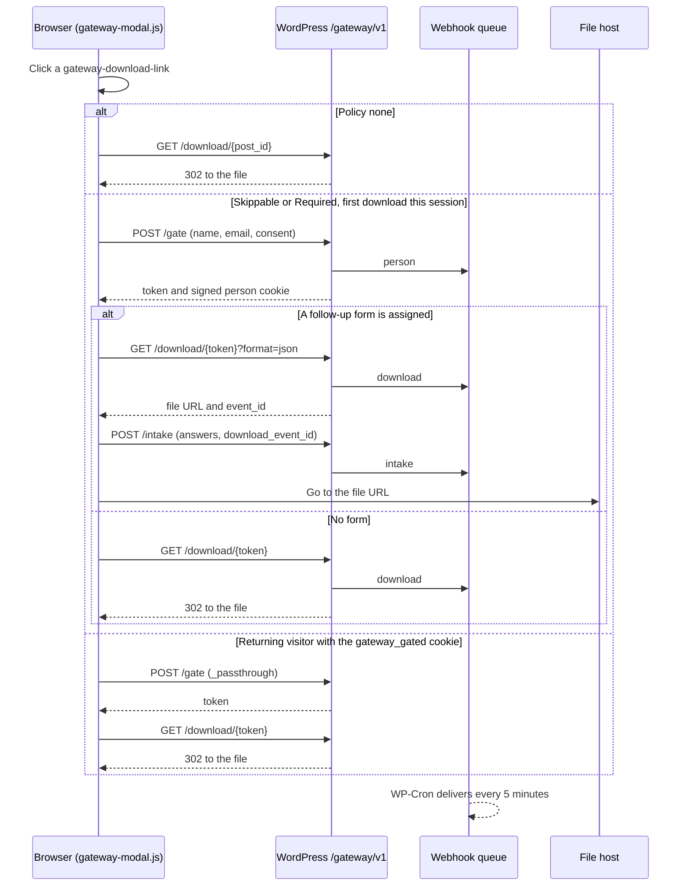

# Download Gateway

The download gateway sits between every download link on the site and the file behind it. It logs each download, can ask for a name and email before releasing a file, can ask a few follow-up questions, and forwards contacts and downloads to Airtable through Make.com. Files are released through single-use, short-lived links, so a copied link stops working.

- **Code:** `wp-content/plugins/download-gateway/` (v0.1.13, namespace `WT\DownloadGateway`, REST namespace `gateway/v1`)
- **Status:** live in production since late March 2026 for videos and captions, and for documents since 2026-09-07 (#598). One planned piece, the anonymization webhook (9b), is not built. See [History and decisions](#history-and-decisions) and [Known gaps and follow-ups](#known-gaps-and-follow-ups).
- **Not the People post type:** `wp_gateway_people` is the table of contacts the gate captures. It is unrelated to the `people` post type (published profiles of staff, board and advisors). See [content-model.md](content-model.md).

## Table of Contents

- [Overview](#overview)
- [Content manager guide](#content-manager-guide)
  - [Where download links appear](#where-download-links-appear)
  - [Download policies](#download-policies)
  - [Follow-up forms](#follow-up-forms)
  - [Shortcode](#shortcode)
  - [What data is collected](#what-data-is-collected)
- [Dropbox integration](#dropbox-integration)
- [Developer guide](#developer-guide)
  - [Rendering a gateway link](#rendering-a-gateway-link)
  - [Registering follow-up form sets](#registering-follow-up-form-sets)
  - [Adding a downloadable content type](#adding-a-downloadable-content-type)
  - [Tests](#tests)
- [System architecture](#system-architecture)
  - [Components](#components)
  - [Request flow](#request-flow)
  - [REST endpoints](#rest-endpoints)
  - [Policy and form resolution](#policy-and-form-resolution)
  - [Tokens and cookies](#tokens-and-cookies)
  - [Database tables](#database-tables)
  - [Webhooks to Airtable](#webhooks-to-airtable)
  - [GA4 events](#ga4-events)
  - [Data retention](#data-retention)
- [Operations and maintenance](#operations-and-maintenance)
- [History and decisions](#history-and-decisions)
- [Known gaps and follow-ups](#known-gaps-and-follow-ups)

---

## Overview

The archive's videos, captions and documents are free to download. The gateway exists so that each download can also start a relationship:

- **Email capture.** A visitor who leaves their email can be followed up. The post-download email, not the modal, is where the donation ask belongs (decided 2026-03-25).
- **Impact reporting.** Downloads per content type, and why people download (the follow-up answers), are reportable to funders.
- **Access control.** Visitors receive short-lived links instead of permanent shared Dropbox URLs.
- **Measurement.** Every step of the download funnel is a GA4 event.

Three content types are downloadable:

| Post type | What it is | Where the file lives |
|---|---|---|
| `document_files` | One version (language, format) of a `documents` resource | WordPress media library |
| `videos` | An oral history | Dropbox, plus an optional Wikimedia Commons copy |
| `captions` | A caption file for a video | Dropbox |

---

## Content manager guide

### Where download links appear

| Surface | What it downloads | Template |
|---|---|---|
| Video pages, "Video file downloads" | The Dropbox `.mp4` and the Wikimedia Commons `.webm`. Shown only when the video's status is Public. | `modules/videos/meta--videos-single.php` |
| Video pages, "Available captions" | Each caption `.srt` | same |
| Document pages, versions table | One row per version (language, format) | `single-documents.php` |
| Page banners with a selected file | The banner's download button | `modules/banners/banner--main.php` |
| Editorial card blocks | A block whose link type is Download, and the secondary button on a block that links a document. Both download the linked document's selected file. | `modules/flexible-content/block-layout.php` |
| Anywhere in content | The `[gateway_download]` [shortcode](#shortcode) | — |

If the gateway is switched off (see [Turning the gateway on and off](#turning-the-gateway-on-and-off)), templates fall back to plain file links and the shortcode renders nothing.

### Download policies

**Where:** WordPress admin → Settings → Download Gateway → *Download access*.

A policy decides what happens when a visitor clicks a download link. There are three levels, and the most specific one wins:

1. **Individual resource.** The *Download Gateway* panel on the edit screen of a document file, video or caption.
2. **Content type.** One row per type in the settings table.
3. **Global default.** The first row of the table.

| Admin label | Stored value | What the visitor sees | Enforced on the server? |
|---|---|---|---|
| None | `none` | One-click download, no modal | — |
| Skippable | `soft` | A modal asks for name and email; the visitor can decline (see note) | No: the direct download URL still works |
| Required | `hard` | A modal where name and email are required | Yes: the direct URL returns 403 |
| Disabled | `disabled` | No download link at all | Yes: the direct URL returns 404 |
| Inherit | — | Uses the next level up | — |

> **Production setting, checked 2026-09-11:** the global default is **Required**, with no per-type overrides, so every gateway download asks for an email. A content type newly wired into the gateway inherits Required unless its row is changed. Policies are stored in the database, so set them on staging and production separately. The next production → staging sync copies production's settings back over staging's.

**Skippable only skips when a follow-up form is assigned.** The *Skip and download* button appears only when the resource has a follow-up form. Without one, the modal has no skip button, so Skippable behaves like Required apart from the missing asterisks. This is a known gap.

To see every resource that overrides its type's policy, use the *Individual resource overrides* table further down the settings page.

### Follow-up forms

After the name and email step, the modal can ask how the visitor plans to use the resource. The answers never block the download: if the form fails to save, the file still downloads.

The theme defines three forms:

| Form | Questions | Defined in |
|---|---|---|
| `videos` | *How will you use this resource?* (research, teaching, documentary or journalism, advocacy or policy, personal interest, other) · *Are you a member of the Wikitongues community?* (speaker or learner, contributor, discovering endangered languages, works with language data professionally) | `modules/videos/gateway-intake.php` |
| `captions` | Same as videos | `modules/captions/gateway-intake.php` |
| `documents` | The use question · *Are you affiliated with an organization?* (optional free text) · the community question | `modules/documents/gateway-intake.php` |

**Assigning a form.** In the settings table, the *Follow-up form → Form* column sets a form per content type (or globally). On a single resource, use *Intake form* in its Download Gateway panel. Like policies, assignments live in the database, so each environment needs its own.

**Asking again.** *Ask every time?* (on a resource, *Show intake on repeat downloads*) controls whether a visitor who already passed the gate this browser session sees the form again on later downloads. The community and organization questions are asked once per person: once someone has answered them, later forms leave them out.

Questions are defined in code, not in the admin. To add or change one, a developer edits the files above (see [Registering follow-up form sets](#registering-follow-up-form-sets)).

### Shortcode

`[gateway_download]` renders a gateway download link anywhere in post content or an ACF text field:

```
[gateway_download id="1234"]
[gateway_download id="1234" label="Download transcript"]
[gateway_download id="1234" source="language-page" language_slug="nch"]
```

| Attribute | Required | Default | Purpose |
|---|---|---|---|
| `id` | Yes | — | Post ID of a document file, video or caption |
| `label` | No | `Download` | Link text |
| `source` | No | — | Sent to GA4 as `download_source`, e.g. `language-page` |
| `language_slug` | No | — | Sent to GA4 as `language_slug` |

The resource's Download Gateway panel shows its shortcode ready to copy (click the field). The shortcode renders an HTML comment if `id` is missing, and nothing at all if the resource is Disabled or the gateway is off. It only works for the three downloadable types; to offer a document with several versions, link to the document's page instead.

### What data is collected

**Everyone whose download goes through the gateway:**

- An anonymous visitor cookie, `gateway_vid`: a random ID kept for a year, set whenever the gateway serves a file. It links downloads from the same browser.
- A download record: which resource, when, the visitor ID, where the file is stored, and a SHA-256 hash of the IP address instead of the address itself.

**Visitors who fill in the modal, in addition:**

- Name and email, stored in plain text in `wp_gateway_people`, with a hash of the email used for matching repeat visitors.
- The *Receive updates on new languages and resources* checkbox, which is ticked by default. It is stored as `consent_download`.
- A session cookie, `gateway_gated`, so the modal doesn't reappear until the browser is closed.
- Follow-up answers, if a form is assigned.
- A copy of the contact, the download and the answers, sent to Airtable via Make.com (see [Webhooks to Airtable](#webhooks-to-airtable)).

GA4 receives the four funnel events, without names or emails.

**Retention:** names and emails are removed from WordPress 24 months (configurable) after the person was first captured. Download records are kept. The Airtable copies are not removed yet. See [Data retention](#data-retention).

---

## Dropbox integration

### How it works (non-technical)

Videos and captions are stored in Dropbox. When a visitor downloads one, the gateway asks Dropbox for a temporary link that expires after 4 hours and sends the visitor there, never to the permanent shared link. A forwarded download link stops working within a few hours, and every new download goes back through the gateway, where it is logged and the current policy applies.

The exception is files in a Dropbox team folder. See [How it works (technical)](#how-it-works-technical).

### Setup (technical)

**1. Create a Dropbox app.** At https://www.dropbox.com/developers/apps, choose *Create app* → **Scoped access** → **Full Dropbox**, and note the **App key** and **App secret**.

**2. Set permissions.** In the app console → Permissions, enable `files.content.read` and `sharing.read`, then *Submit*.

**3. Generate a refresh token.** Use the OAuth2 authorization code (or PKCE) flow with `token_access_type=offline`, with the app key and secret as Basic auth credentials. This is a one-time step; the refresh token doesn't expire unless revoked.

**4. Add the constants to `wp-config.php`.** Credentials never go in the database.

```php
define( 'GATEWAY_DROPBOX_APP_KEY',       'your-app-key' );
define( 'GATEWAY_DROPBOX_APP_SECRET',    'your-app-secret' );
define( 'GATEWAY_DROPBOX_REFRESH_TOKEN', 'your-refresh-token' );
```

**5. Verify.** Settings → Download Gateway → *Integrations* should read "✓ Connected. Video and caption files are served via Dropbox."

**6. Test.** Download a video or caption and confirm the browser lands on a `dl.dropboxusercontent.com` URL.

### How it works (technical)

`DropboxAdapter` (`class-dropbox-adapter.php`) makes three calls, each cached in a WordPress transient:

| Step | API | Transient | TTL |
|---|---|---|---|
| Access token | `POST oauth2/token` (refresh-token grant) | `gateway_dbx_access_token` | 3.5 hours |
| File path | `sharing/get_shared_link_metadata` → `path_lower` | `gateway_dbx_path_{md5(shared_url)}` | 7 days |
| Temporary link | `files/get_temporary_link` (valid 4 hours) | `gateway_dbx_link_{md5(file_path)}` | 3.5 hours |

`VideoFileResolver` reads the ACF `dropbox_link` field on videos; `CaptionFileResolver` reads `file_url` on captions. Both delegate to the adapter.

**Team-folder fallback.** `files/get_temporary_link` returns 409 for files in a Dropbox team folder. For those, the adapter builds a direct-download form of the shared link (`dl=1`, session token stripped, `rlkey` kept) and caches it for 7 days. That link doesn't expire, so the short-lived-link guarantee only covers files outside team folders.

If any other step fails, the resolver returns null and the visitor gets a 404. The raw shared URL is never used as a fallback.

### Troubleshooting Dropbox

| Symptom | Likely cause | Fix |
|---|---|---|
| Settings shows "✗ Not connected" | A `GATEWAY_DROPBOX_*` constant is missing or empty | Check all three in `wp-config.php` |
| 404 on a video or caption | File deleted, shared link revoked, or credentials rejected | Confirm the file and its shared link exist; check the PHP error log |
| Works once, then fails | Refresh token revoked | Generate a new refresh token and update `wp-config.php` |
| `get_shared_link_metadata` errors | The app belongs to a different account from the one that owns the files | Use an app on the account that owns the folders |
| Browser lands on `dropbox.com/...?dl=1` instead of `dl.dropboxusercontent.com` | The file is in a team folder (fallback above) | Expected. Move the file out of the team folder if it needs an expiring link |

---

## Developer guide

### Rendering a gateway link

The modal script binds to any anchor with the class `gateway-download-link` and reads everything else from data attributes. Every template that renders a download follows this contract:

```html
<a href="{ rest_url( 'gateway/v1/download/' . $post_id ) }"
   class="gateway-download-link"
   data-post-id="{ post ID }"
   data-policy="{ PolicyResolver::resolve( $post_id ) }"
   data-post-type="{ document_files, videos or captions }"
   data-intake-set="{ IntakeResolver::resolve( $post_id )['set'] }"
   data-intake-always="{ 0 or 1 }"
   data-language-slug="nch"              optional, for GA4
   data-download-source="resource-page"  optional, for GA4
   data-file-url="https://…">            optional, external files only
```

- **One `class` attribute.** An HTML parser keeps the first `class` attribute and drops any second one. An anchor built with two therefore loses `gateway-download-link`, and the click skips the modal, the policy and the logging (#623).
- **Resolve the policy first.** Render nothing, or "Unavailable", when it is `disabled`.
- **Fall back when the gateway is off.** The templates check `shortcode_exists( 'gateway_download' ) && GATEWAY_ENABLED` and render a plain file link otherwise.
- **External files.** For the Wikimedia Commons link, `href` and `data-file-url` are both the external URL. The modal still runs, so the contact and answers are captured, and then the browser goes straight to the external file. The server never sees the download itself, so there is no download record and no download webhook.

When in doubt, use the shortcode, which renders exactly this markup.

### Registering follow-up form sets

Sets come from the `gateway_intake_fields` filter, an array keyed by set name. The theme keeps one file per set at `modules/{name}/gateway-intake.php`, and `functions.php` loads every file matching that pattern, so a new set needs no other registration:

```php
// modules/lexicons/gateway-intake.php
add_filter(
	'gateway_intake_fields',
	function ( array $sets ): array {
		$sets['lexicons'] = array(
			array(
				'key'     => 'use_case',
				'label'   => 'How will you use this resource?',
				'type'    => 'select',
				'options' => array(
					'research' => 'Personal or academic research',
					'other'    => 'Other',
				),
			),
		);
		return $sets;
	}
);
```

| Field key | Meaning |
|---|---|
| `key` | Machine name; becomes the response key in the stored JSON |
| `label` | Question text |
| `type` | `text`, `textarea`, `select`, `radio` or `checkbox` |
| `options` | `value => label` pairs, for `select` and `radio` |
| `required` | Informational only; the modal doesn't enforce it |

After adding a set, assign it in the settings table on each environment. Two keys have special meaning: `community` and `organization` are person-level, so they are asked once per person (`PERSON_LEVEL_KEYS` in `gateway-modal.js`, and the passthrough check in `GateController`). Responses are stored as a JSON blob and sanitized as plain text, so field definitions can change without a schema change.

### Adding a downloadable content type

1. Implement `FileResolver`:

   ```php
   class LexiconFileResolver implements FileResolver {
       public function resolve( int $post_id ): ?string {
           $url = get_field( 'dropbox_link', $post_id );
           return $url ? ( new DropboxAdapter() )->get_temporary_link( $url ) : null;
       }

       public function storage_type(): string {
           return 'dropbox'; // 'media', 'dropbox' or 'external'
       }
   }
   ```

2. `require_once` it in `download-gateway.php` and register it: `FileResolverRegistry::register( 'lexicons', new LexiconFileResolver() );`
3. The type now gets a row in the settings table and the Download Gateway panel on its edit screens.
4. **Set its policy on every environment.** It inherits the global default, which is Required on production. `PolicyResolver` has no filter hook, so pinning a policy in code means changing the plugin.
5. Render links following the [link contract](#rendering-a-gateway-link), and add the type to `RESOURCE_LABELS` in `gateway-modal.js`, which supplies the modal copy ("This oral history is part of…").
6. Optionally, register a follow-up form set.
7. Posts synced from Airtable carry `_airtable_record_id`, and webhooks include it automatically.

### Tests

`tests/unit/download-gateway/` holds 16 test classes covering the controllers, resolvers, repositories, cookies, IP hashing, the Dropbox adapter, webhook delivery and retention. Run them with `composer test`. Each controller keeps its logic in a method that takes cookies and server variables as parameters (`resolve()`, `submit()`), so it can be tested without superglobals. The `handle()` wrappers that send responses are not unit-tested.

---

## System architecture

### Components

| Component | Role |
|---|---|
| `download-gateway.php` | Bootstrap: feature flag, hooks, script localization, resolver registration, cron schedules |
| `DownloadController` | `GET /download/{id}`: resolves a token or post ID to a file and logs it |
| `GateController` | `POST /gate`: the modal form and silent passthrough for returning visitors |
| `IntakeController` | `POST /intake`: follow-up answers |
| `PolicyResolver`, `IntakeResolver` | The three-tier policy and form lookups |
| `SettingsRepository` | Option keys and defaults; reads the Dropbox constants |
| `TokenRepository`, `PeopleRepository`, `DownloadEventRepository`, `IntakeRepository` | Access to the gateway tables |
| `VisitorId`, `PersonCookie`, `IpHasher` | Cookies and hashing |
| `FileResolverRegistry`, `DocumentFileResolver`, `VideoFileResolver`, `CaptionFileResolver`, `DropboxAdapter` | Finding the file behind a post |
| `WebhookDispatcher`, `RetentionJob` | The two scheduled jobs |
| `EventBus` | Fires `gateway/download/click` and `gateway/download/redirect` actions (nothing listens yet) |
| `Settings_Page`, `Resource_Metabox`, `Download_Shortcode` | Admin screens and content |
| `assets/js/gateway-modal.js` | Click interception, the modal, GA4 events |

### Request flow



Details the diagram leaves out:

- **Why the form path fetches JSON first.** Answers must reference the download they belong to. The modal therefore redeems the token with `?format=json`, which logs the download and returns its `event_id`, then submits the answers with that ID, then navigates to the file (#592).
- **Passthrough with "ask every time".** When the form is set to show on repeat downloads, a returning visitor skips the name and email step but still sees the form (minus the person-level questions).
- **Passthrough after anonymization.** If the person behind the cookie has been anonymized, the passthrough returns 410 and the modal opens as for a new visitor.
- **Skip and download.** On a Skippable resource with a form, the skip button sends the browser to `/download/{post_id}`: no person record, no answers.
- **External links.** For Wikimedia Commons, the last step goes straight to the external URL. The token issued by the gate is never redeemed.

### REST endpoints

Routes are registered only when `GATEWAY_ENABLED` is true. All three are public; they are protected by nonces, the signed person cookie, single-use tokens, a rate limit and a honeypot field.

| Method | Endpoint | Accepts | Returns |
|---|---|---|---|
| `GET` | `/wp-json/gateway/v1/download/{id}` | `id`: a numeric post ID or a 64-character hex token; optional `format=json` | 302 to the file, sent with no-cache headers, or `{url, event_id}` with `format=json`. Errors: 400 invalid ID · 403 `gate_required` (a post ID whose policy is Required) · 404 disabled, no resolver, or file missing · 410 token unknown, used or expired |
| `POST` | `/wp-json/gateway/v1/gate` | `post_id`, `name`, `email`, `consent_download`, `nonce`, `_hp`; or `post_id` and `_passthrough` | `{token, person_cookie}`; passthrough adds `completed_person_fields`. Errors: 403 bad nonce · 400 invalid input or tampered cookie · 410 person anonymized · 429 more than 10 form submissions per IP per hour. A filled honeypot gets a silent `{token: null}` |
| `POST` | `/wp-json/gateway/v1/intake` | `post_id`, `person_cookie`, `nonce`, `responses`, `download_event_id` | `{success: true}`. Errors: 403 bad nonce · 400 invalid cookie · 404 unknown post · 500 save failed |

### Policy and form resolution

Each setting is looked up per resource, then per content type, then globally. An empty or `inherit` value falls through to the next level.

| Setting | Per resource (post meta) | Per content type (option) | Global (option) | Default |
|---|---|---|---|---|
| Gate policy | `_gateway_gate_policy` | `gateway_cpt_policy_{post_type}` | `gateway_global_gate_policy` | `none` in code; production is set to `hard` |
| Follow-up form | `_gateway_intake_set` | `gateway_cpt_intake_set_{post_type}` | `gateway_global_intake_set` | `none` |
| Ask every time | `_gateway_intake_always` | `gateway_cpt_intake_always_{post_type}` | `gateway_global_intake_always` | off |

For the form setting, `none` means "no form" and stops the lookup. The settings table lists every type registered in `FileResolverRegistry`; the `gateway_policy_post_types` filter can change that list.

### Tokens and cookies

| Item | Details |
|---|---|
| Download token | 64 hex characters (`random_bytes(32)`), valid for 1 hour, single use. Stored in `wp_gateway_tokens` with the post, visitor and person. Timestamps are UTC. |
| `gateway_vid` | 32 hex characters, 1 year, HttpOnly, SameSite=Lax, Secure over HTTPS. Set by the server whenever it serves a file. Malformed values are ignored. |
| `gateway_gated` | Session cookie set by the modal script: `{person_id}.{HMAC-SHA256}`, signed with WordPress's `NONCE_KEY`. Rotating the WordPress salts invalidates it, and visitors see the modal again. |

### Database tables

The plugin creates five tables with `dbDelta()` and upgrades them on `plugins_loaded` when `gateway_schema_version` is behind the code (currently version 2).

| Table | One row per | Main columns |
|---|---|---|
| `wp_gateway_people` | Email-known visitor | `email_hash` (unique), `email`, `name`, `consent_download`, `is_anonymized`, `created_at`, `anonymized_at` |
| `wp_gateway_tokens` | Issued token | `token`, `post_id`, `visitor_id`, `person_id`, `expires_at`, `used_at` |
| `wp_gateway_download_events` | Logged download step | `post_id`, `post_type`, `event_type`, `visitor_id`, `person_id`, `storage_type`, `ip_hash`, `created_at` |
| `wp_gateway_intake_responses` | Follow-up submission | `person_id`, `post_id`, `post_type`, `responses` (JSON) |
| `wp_gateway_webhook_delivery` | Outbound webhook | `event_id`, `payload` (JSON), `status`, `attempts`, `next_attempt_at` |

- **Event types.** `redirect` is logged for every file the server serves. `click` is logged only when a download starts from a post ID, i.e. None, and Skippable skips. Count `redirect` rows to count downloads.
- **Reserved but unused.** The `gate_view` and `gate_submit` event types, the `utm_*` and `referrer` columns, and `consent_marketing` are never written. The funnel steps before the download exist only in GA4.
- **Time zones.** Token timestamps are UTC. Everything else uses the site's local time (`current_time( 'mysql' )`).

### Webhooks to Airtable

**Endpoint:** Settings → Download Gateway → *Integrations* → *Notification URL* (option `gateway_webhook_endpoint`). It points at the Make.com *Gateway Webhook Router* scenario, which writes Airtable's Downloads and People tables. That scenario is documented in [airtable-sync.md](airtable-sync.md#gateway-webhook-router). A blank URL turns webhooks off.

| `type` | Sent when | Fields |
|---|---|---|
| `person` | The modal form is submitted | `person_id`, `name`, `email`, `email_hash`, `consent_download`, `created_at` |
| `download` | The server serves a file | `event_id`, `person_id`, `post_id`, `post_type`, `airtable_record_id`, `policy`, `created_at` |
| `intake` | Follow-up answers are saved | `person_id`, `download_event_id`, `post_id`, `post_type`, `airtable_record_id`, `intake_set`, `responses`, `created_at` |

`airtable_record_id` lets Make join a download to its Videos, Captions or Lexicons record; `download_event_id` lets it update the matching Download record without a search (#589, #592).

**Delivery.** Webhooks are queued in `wp_gateway_webhook_delivery`. The WP-Cron event `gateway_webhook_dispatch` runs every 5 minutes and sends up to 50 due rows, oldest first, as JSON POSTs with a 10-second timeout. A 2xx response marks a row `delivered`. Anything else marks it `failed` and retries after 1 minute, 5 minutes, 30 minutes and 2 hours; the fifth failed attempt marks it `dead`. Rows are never deleted.

**Self-healing schedule.** Both cron events are re-registered on every `plugins_loaded` if missing (#595). Before that fix, the dispatch event was lost once and 208 webhooks sat undelivered for about five months.

### GA4 events

The modal script pushes four events to `window.dataLayer`; Google Tag Manager forwards them to GA4. There is no gtag code in the theme.

| Event | Fires when | Parameters |
|---|---|---|
| `resource_download_click` | Any gateway link is clicked, whatever the policy | `post_id`, `post_type`, `policy`, `language_slug`, `download_source` |
| `resource_download_gate_open` | The modal opens | `post_id`, `post_type`, `policy`, `language_slug` |
| `resource_download_gate_submit` | The server accepts the modal form | the above, `download_source`, `consent_download` |
| `resource_download_redirect` | Just before the browser goes to the file | `post_id`, `post_type`, `policy`, `language_slug`, `download_source` |

- **GTM:** 6 data-layer variables, 4 custom-event triggers, 4 GA4 event tags.
- **GA4:** `gate_submit` (email capture) and `redirect` (download complete) are key events. `post_type`, `policy` and `consent_download` are registered custom dimensions (2026-03-28); `language_slug` and `download_source` were already registered.
- **Funnel:** click → gate open → gate submit → redirect. A None download fires only `click`, because the browser follows the link without the modal. A returning visitor fires `click` and `redirect`.

### Data retention

A daily WP-Cron event, `gateway_retention_daily`, anonymizes every person whose `created_at` is older than the retention window (default 24 months, settable from 1 to 120 on the settings page). Anonymizing nulls `name` and `email`, rewrites `email_hash` to `anon-{id}` so the same address can be captured again as a new person, and sets `is_anonymized` and `anonymized_at`. The row stays, so download history remains countable.

The last run is recorded in `gateway_retention_last_run` and shown under *Privacy cleanup*, where *Run cleanup now* runs it by hand.

What retention does not touch yet: the Airtable copies (9b), delivered `person` webhook payloads, and follow-up answers. The clock starts at first capture, not at the latest download. See [Known gaps and follow-ups](#known-gaps-and-follow-ups).

---

## Operations and maintenance

### Turning the gateway on and off

The plugin ships switched off. `wp-config.php` turns it on:

```php
define( 'GATEWAY_ENABLED', true );
```

When off, the REST routes aren't registered, the modal script and styles aren't loaded, the shortcode renders nothing, and templates show plain file links. The settings page still loads, with a "Gateway is inactive" notice.

### Scheduled jobs

| Event | Schedule | Job |
|---|---|---|
| `gateway_webhook_dispatch` | Every 5 minutes | Deliver queued webhooks |
| `gateway_retention_daily` | Daily | Anonymize people past the retention window |

WP-Cron only runs when someone loads a page. A server cron (cPanel) that runs `wp cron event run --due-now` every 5 minutes would make both jobs independent of traffic; production doesn't have one yet. Check the schedule with `wp cron event list --allow-root | grep gateway`.

### Testing on localhost

A local site synced from production has production's `gateway_webhook_endpoint`, and nothing in the dispatcher checks the environment. A download clicked on localhost therefore creates real Airtable Download and People records on the next cron tick. Before testing gateway flows locally, blank the Notification URL in the local settings; the next sync restores it.

### Viewing download data

There is no reporting screen by design: use Airtable views, or query the tables with WP-CLI or a database client.

```bash
# Downloads per content type, last 30 days
wp db query "SELECT post_type, COUNT(*) AS downloads
             FROM wp_gateway_download_events
             WHERE event_type = 'redirect'
               AND created_at >= DATE_SUB(NOW(), INTERVAL 30 DAY)
             GROUP BY post_type;" --allow-root

# Webhook queue health
wp db query "SELECT status, COUNT(*) FROM wp_gateway_webhook_delivery GROUP BY status;" --allow-root
```

These tables hold names and emails. Write any export to `~/backups/` or your own machine, never anywhere under `public_html`, where the web server can serve it.

### Common problems

| Symptom | Likely cause | Fix |
|---|---|---|
| Clicking a link downloads directly, no modal | Policy is None, or the link lacks the `gateway-download-link` class | Check the policy; check the rendered anchor has one `class` attribute |
| Modal never opens anywhere | `GATEWAY_ENABLED` is false, or the script failed | Check `wp-config.php` and the browser console |
| 403 on a download | Required resource opened by post ID, or an expired nonce | Download through the page; hard-refresh for a new nonce |
| 404 on a download | Post deleted, no resolver for the type, policy Disabled, or file missing | Check the post, its type, its policy and the file |
| 410 on a download | Token used or expired | Click the link again; a new token is issued |
| No follow-up form | No form assigned to the resource or its type | Assign one in the settings table |
| Airtable isn't receiving downloads | Webhook queue stalled or rows `dead` | Check the queue query above and `wp cron event list`; confirm the Notification URL |
| Make run fails with `422 UNKNOWN_FIELD_NAME` on *Last seen* | People *Last seen* is an Airtable Lookup (read-only) | Remove the *Last seen* mapping from the scenario's People module ([airtable-sync.md](airtable-sync.md#gateway-webhook-router)) |

### Logs

The plugin writes through `error_log()`, prefixing each line with `[download-gateway]` and a level: `[download-gateway] [ERROR] …`. `DEBUG` lines are written only when `WP_DEBUG` is true; `INFO` and `ERROR` lines always are. They land in the PHP error log: on production, the `error_log` file PHP writes in the site root, or `wp-content/debug.log` wherever `WP_DEBUG_LOG` is on.

### Uninstalling

Deleting the plugin in the admin drops all five tables, deletes the policy, retention and schema options, and unschedules the retention job. **This destroys all download history, contacts and answers.** Export anything you need first. Uninstalling leaves behind the follow-up form options, the webhook URL and the webhook cron event.

---

## History and decisions

Built between March and September 2026. The numbers are the sub-phases the original plan used.

| Sub-phase | What shipped | PRs | Merged |
|---|---|---|---|
| 0–3 | Plugin scaffold and `GATEWAY_ENABLED`; schema; policy, settings and event primitives; download endpoint with tokens and the visitor cookie | #560 | 2026-03-14 |
| 5 (with 2b) | Skippable and Required gates; people upsert; one-time tokens; nonce, rate limit, honeypot; resource panel and shortcode; passthrough | #561, #564 | 2026-03-15 – 16 |
| 9 | Retention job and settings | #565 | 2026-03-16 |
| 5b-i | Per-type policy level; the Disabled value; the overrides table | #566 | 2026-03-16 |
| 5b-ii | Follow-up form infrastructure: intake table, `/intake`, modal step 2 | #567 | 2026-03-16 |
| 6 | Dropbox adapter; video and caption resolvers; signed person cookie; fixes from a security review | #568 | 2026-03-21 |
| 5b-iii | Named form sets and their three-level lookup; the gate cookie became session-only | #572 | 2026-03-26 |
| 2c | Webhook queue and delivery | #573 | 2026-03-27 |
| 5c | Modal redesign | #574 | 2026-03-27 |
| — | First production release | #577 | 2026-03-27 |
| 7 | GA4 dataLayer events | #578, #582, #585 | 2026-03-27 |
| — | Settings page redesign | #579 | 2026-03-27 |
| 8 | Admin reporting: dropped | #588 | 2026-04-12 |
| — | `airtable_record_id` and `download_event_id` in payloads; event-ID timing fix | #589, #592 | 2026-04-19 |
| — | Self-healing cron schedule | #595 | 2026-09-07 |
| 10 | Documents routed through the gateway; `force_download_file()` and `/force-download/` removed | #598 | 2026-09-07 |
| — | Oral-history CTAs routed through the document page; card-block secondary button fixed | #619, #623 | 2026-09-09 – 11 |
| 9b | Anonymization webhook | — | Not built |

**Decisions worth keeping:**

- **Signed, single-use tokens and a redirect, not streaming.** Files never pass through PHP. Each download is one short request, and a leaked link dies within the hour.
- **The downloadable unit is the leaf post:** a document version, a video, a caption. Templates own the choosing UI; the plugin doesn't know what a "document" is.
- **Follow-up forms live in code, not ACF.** The plugin renders whatever the theme declares.
- **No donation ask in the modal (2026-03-25).** The visitor has just received the file, and the modal is already two steps. The ask belongs in the post-download email, personalized by their answers.
- **No reporting screen (2026-04-12).** Airtable views and a database client already answer the questions.
- **Form 990s bypass the gateway (2026-09-11).** Public-disclosure documents should be one click away. With a Required site default, one missed per-type setting would have put them behind an email.
- **Dropbox credentials live only in `wp-config.php`.**

---

## Known gaps and follow-ups

Prioritized in [plan.md](../plan.md). Security hardening from the March 2026 review is tracked outside the public repo, in `docs/local_docs/`.

1. **Anonymization stops at WordPress (9b).** `RetentionJob::anonymize()` updates rows in bulk and queues nothing, so Airtable keeps names and emails after WordPress drops them. Fix: select the affected IDs before the update, queue a `type: anonymize` webhook for each, and add a Make branch that clears the Airtable People record (and, later, the Mailchimp contact).
2. **Retention leaves copies behind.** Delivered `person` payloads, which include name and email, stay in `wp_gateway_webhook_delivery`, and the free-text organization answer stays in follow-up responses. The window counts from first capture, not last activity.
3. **The mobile email step converts poorly.** In the first month, 60% of desktop visitors who saw the modal submitted it, against 7.7% on mobile (small sample, March–April 2026).
4. **Skippable without a form has no skip button**, so it behaves like Required.
5. **Disabled doesn't hide the Wikimedia Commons link** on video pages. The Dropbox link disappears, but the Commons link renders as a plain, ungated link.
6. **Downloads of external files aren't logged by the server**: no download record, no download webhook.
7. **Skip and download sends no GA4 `redirect` event.**
8. **Local copies deliver webhooks to production**: nothing checks the environment.
9. **Retry times mix time zones.** Rows are queued and selected by site-local time, but retries are scheduled in UTC, so they run late by the site's UTC offset.
10. **Expired tokens are never purged.** `TokenRepository::purge_expired()` has no caller, and a download started from a post ID also writes a token it never uses.
11. **Unused schema.** Either populate or drop the `gate_view` and `gate_submit` event types, the `utm_*` and `referrer` columns, and `consent_marketing`.
12. **Consent and cookies are undecided.** The *Receive updates* box is ticked by default, and `gateway_vid` is set without a consent step. Settle both before email marketing starts.
13. **WP-Cron depends on traffic.** No server cron is confirmed on production.
14. **Uninstall leaves some settings behind**: the form options, the webhook URL, and the webhook cron event.
15. **Duplicate Airtable Download records** from the 2026-09-08 replay: dedupe on `download_event_id`. See [airtable-sync.md](airtable-sync.md#gateway-webhook-router).
